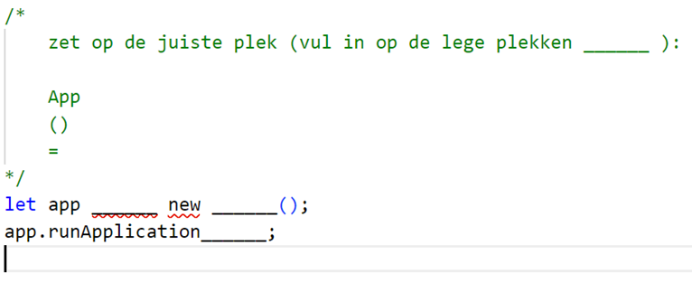

# Vul aan Arrays

bekijk de `app.js` file op je opgave blad

in de `app.js` staan een heleboel vraagtekens (`?`).
Deze moeten jij invullen

in het commentaar erboven staan de opties. 1 per regel.

voorbeeld:

Hier hebben we 3 opties in het commentaar:
- App
- ()
- =

Nu zetten we die op de plek van de vraagtekens (`?`). Het eerste vraagteken moet de `=` worden dan krijgen we:

dan krijgen we:

